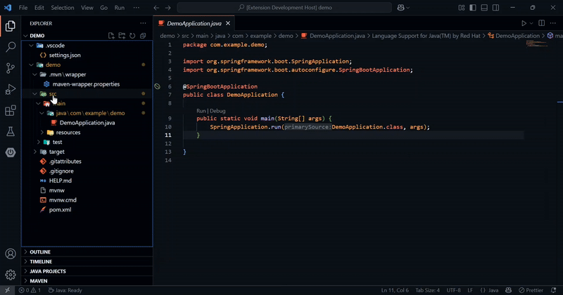
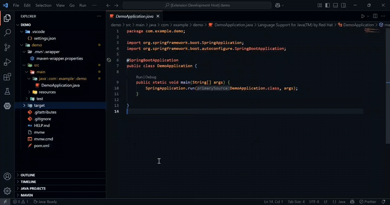
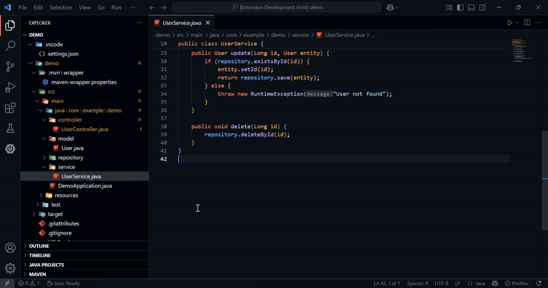

# Spring Project Boilerplate

<p align="center">
  
  <br>
  <em>Accelerate. Generate. Focus.</em>
</p>

<p align="center">
  <a href="https://marketplace.visualstudio.com/items?itemName=your-publisher.spring-project-boilerplate"></a>
  <a href="https://marketplace.visualstudio.com/items?itemName=your-publisher.spring-project-boilerplate"></a>
  <a href="https://marketplace.visualstudio.com/items?itemName=your-publisher.spring-project-boilerplate"></a>
  

</p>

> **Transform your development workflow** with a powerful VS Code extension that eliminates repetitive code creation and enforces best practices for Java & Spring Boot. Scaffold complete enterprise-ready projects in seconds.

## 🌟 What Sets Us Apart

Unlike generic code generators, Spring Project Boilerplate:

- **Intelligently analyzes** your existing code structure
- **Seamlessly integrates** with your existing projects
- **Creates context-aware components** that follow Spring Boot best practices
- **Reduces technical debt** with consistent, well-structured code

---
## ✨ Key Features

<table>
  <tr>
    <td width="50%">
      <h3>🚀 Complete Project Scaffolding</h3>
      <p>Instantly bootstrap a professional Spring Boot architecture with all essential layers pre-configured.</p>
      <ul>
        <li>Clean, consistent package structure (Layered pattern)</li>
        <li>Best practice folder organization</li>
        <li>Supports both Maven and Gradle projects</li>
      </ul>
    </td>
    <td width="50%">
      <h3>⚡ Full CRUD Generation</h3>
      <p>Transform an Entity into a full backend stack with one click:</p>
      <ul>
        <li>Entity → Repository → Service → Controller</li>
        <li>Standard CRUD endpoints (GET, POST, PUT, DELETE)</li>
        <li>All layers properly connected and annotated</li>
      </ul>
    </td>
  </tr>
  <tr>
    <td width="50%">
      <h3>🔄 DTO & Mapper Integration</h3>
      <p>Promote clean API design with automatic DTO & Mapper scaffolding:</p>
      <ul>
        <li>Choose between standard Java class or MapStruct interface</li>
        <li>Ready-to-edit conversion methods included</li>
        <li>Separation of concerns is built-in</li>
        <li><em>Field-level mapping coming soon</em></li>
      </ul>
    </td>
    <td width="50%">
      <h3>🔍 Intelligent Context Menus</h3>
      <p>Adaptive UI that shows only relevant options for your current folder or file:</p>
      <ul>
        <li>Right-click on relevant folders for targeted generation</li>
        <li>Automatic package detection (standard structure)</li>
        <li>Clear, informative feedback on each action</li>
      </ul>
    </td>
  </tr>
  <tr>
    <td width="50%">
      <h3>🛡️ Spring Security Scaffolding</h3>
      <p>Generate up-to-date Spring Security configuration files (Java-based, Spring Boot 3+ style) instantly.</p>
      <ul>
        <li>Best-practice SecurityConfig template</li>
        <li>Customizable for your project's needs</li>
      </ul>
    </td>
    <td width="50%">
      <h3>🛠️ Generate Missing Layers</h3>
      <p>Don't repeat yourself—automatically create missing Controllers, Services, or Repositories for all Entities.</p>
      <ul>
        <li>Scan existing models to fill in missing backend layers</li>
        <li>No risk of overwriting your code</li>
      </ul>
    </td>
  </tr>
</table>

**Note:**  
- *Currently optimized for the standard (Layered) Spring Boot architecture. Hexagonal/Clean/DDD patterns can be used by manually reorganizing folders and applying commands in each context.*
- *Field-level customization and additional architecture support are planned for future updates.*


---

## 📊 Productivity Impact

Spring Project Boilerplate lets you automate the boring parts of Spring Boot development.

- Instantly generate standard project structure and boilerplate code.
- Create full CRUD stacks, DTOs, Mappers, and security classes in seconds.
- Spend less time on setup and more time on business logic.

> **Save hours every week** and keep your codebase clean, consistent, and production-ready.

*Your feedback helps us improve! Try it out and let us know what features you want next.*


---

## 🚀 Getting Started

### Prerequisites

- **Java Development Kit**: JDK 17+ (JDK 21+ recommended)
- **VS Code**: v1.100.0 or newer
- **Spring Boot**: Compatible with versions 2.7.x through 3.2.x
- **Project Structure**: Standard Maven or Gradle layout (src/main/java/...)

### Installation

1. Open **VS Code**
2. Go to **Extensions** (`Ctrl+Shift+X`)
3. Search for **Spring Project Boilerplate**
4. Click **Install**

### Quick Start Guide

<details>
<summary><b>📂 Create Complete Project Structure</b></summary>
<p>

1. Right-click on the <code>src</code> folder  
2. Select <b>Spring Project Boilerplate → Create Spring Boot Structure</b>  
3. Your project will instantly have the following structure:

<pre>
src/main/java/com/example/yourproject/
├── model/
├── repository/
├── service/
├── controller/
├── dto/
└── mapper/
</pre>

</p>
</details>

<details>
<summary><b>🧩 Create Entity with Full CRUD Stack</b></summary>
<p>

1. Right-click on <code>src</code> folder  
2. Select <b>Create Entity with Layers</b>  
3. Enter your entity name (e.g., <code>Product</code>)  
4. The extension automatically generates:<br>
   • <code>Product.java</code> (Entity with JPA annotations)<br>
   • <code>ProductRepository.java</code> (Spring Data JPA interface)<br>
   • <code>ProductService.java</code> (Service with standard CRUD operations)<br>
   • <code>ProductController.java</code> (REST controller with endpoints)

</p>
</details>

<details>
<summary><b>🗂️ Create Entity (Model Only)</b></summary>
<p>

1. Right-click on <code>src</code> folder  
2. Select <b>Create Entity (Model Only)</b>  
3. Enter your entity name  
4. Only the Entity class will be created in the <code>model</code> folder, ready for your customization

</p>
</details>

<details>
<summary><b>🔄 Generate DTO & Mapper for Existing Entities</b></summary>
<p>

1. Right-click on any Entity class in the <code>model</code> folder  
2. Select <b>Generate DTO & Mapper</b>  
3. Choose your preference:<br>
   • Standard Java mapper (manual implementation)<br>
   • MapStruct interface (requires dependency)

</p>
</details>

<details>
<summary><b>🔍 Find & Generate Missing Components</b></summary>
<p>

1. Right-click on any layer folder (e.g., <code>controller/</code>, <code>service/</code>, <code>repository/</code>)  
2. Select the corresponding <b>Generate Missing ...</b> action  
3. The extension scans your project, finds Entities missing that layer, and generates the necessary files automatically

</p>
</details>

<details>
<summary><b>🛡️ Generate Spring Security Classes</b></summary>
<p>

1. Right-click on the <code>src</code> folder  
2. Select <b>Generate Spring Security Classes</b>  
3. The extension will create up-to-date <code>SecurityConfig.java</code> and related configuration files using best practices for Spring Boot 3+  
4. Easily extend or customize as needed for your application's security requirements

</p>
</details>
<details>
<summary><b>⚠️ Generate Global Exception Handler</b></summary>
<p>

1. Right-click on the <code>src</code> folder  
2. Select <b>Generate Global Exception Handler</b>  
3. The extension will create a standard <code>GlobalExceptionHandler.java</code> class under your base package,  
   pre-configured with <code>@RestControllerAdvice</code> and example handler methods.

</p>
</details>

---

**Tip:** All actions are context-aware. Only relevant options are shown for each folder or file to keep your workflow clean and focused.


## 📸 See It In Action

| Project Structure Creation | Entity with Layers | DTO & Mapper Generation |
|:-------------------------:|:------------------:|:----------------------:|
|  |  |  |

---
## 🧠 Advanced Usage

### Security Configuration Example

When you use **Generate Spring Security Classes**, the extension creates a modern and clean Spring Security config for Spring Boot 3.x:
```java
@Configuration
@EnableWebSecurity
public class SecurityConfig {

    @Bean
    public SecurityFilterChain securityFilterChain(HttpSecurity http) throws Exception {
        return http
            .csrf(csrf -> csrf.disable())
            .authorizeHttpRequests(auth -> auth
                .requestMatchers("/api/public/**").permitAll()
                .anyRequest().authenticated()
            )
            .sessionManagement(session -> session
                .sessionCreationPolicy(SessionCreationPolicy.STATELESS)
            )
            .httpBasic(Customizer.withDefaults())
            .build();
    }

    // You can extend or customize authentication beans as needed
}
```
## 🛠️ Troubleshooting

<details>
<summary><b>Common Issues & Solutions</b></summary>
<p>

### Extension doesn't detect my project structure  
**Solution:** Make sure your project follows the standard Spring Boot layout (`src/main/java/...`).

---

### MapStruct mapper doesn't compile  
**Solution:** If you choose MapStruct mappers, add MapStruct dependencies to your `pom.xml` or `build.gradle`:

<pre>
&lt;dependency&gt;
    &lt;groupId&gt;org.mapstruct&lt;/groupId&gt;
    &lt;artifactId&gt;mapstruct&lt;/artifactId&gt;
    &lt;version&gt;${org.mapstruct.version}&lt;/version&gt;
&lt;/dependency&gt;

</pre>

---

### Generated code doesn't match your preferred style  
**Solution:** Edit the generated code as needed. (Customizable templates coming soon.)

</p>
</details>

---

## 📝 Release Notes

### 1.1.0 (Latest)
- Added Spring Boot 3.2+ support
- Improved detection for DTO generation

### 1.0.0
- Initial release: project structure, CRUD generation, DTO/Mapper, Security classes

---

## 🔮 Roadmap

- **Field-level customization** for DTOs and Mappers
- **Unit & integration test class generation**
- **Custom code templates**
- **Database schema import for entity generation**
## ❤️ Support & Contribution

- **GitHub**: [Open issues or contribute](https://github.com/altmemy/spring-project-boilerplate)
- **LinkedIn**: [Connect on LinkedIn](https://www.linkedin.com/in/altmemy/)
- **Twitter (x)**: [@altmemy199](https://x.com/altmemy199)

<!-- 
Optional: Add Discord/Community link if available
- **Community**: [Join our Discord](https://discord.gg/yourcommunity)
-->


<p align="center">
  <em>Empowering Java & Spring Boot developers with modern, automated project scaffolding.</em>
  <br><br>
  <a href="https://github.com/altmemy/spring-project-boilerplate/blob/main/LICENSE">Apache 2.0 License</a> &nbsp;|&nbsp;
  <a href="https://github.com/altmemy/spring-project-boilerplate">View on GitHub</a> &nbsp;|&nbsp;
  <a href="https://marketplace.visualstudio.com/items?itemName=your-publisher.spring-project-boilerplate">VS Code Marketplace</a>
</p>

